# Schéma base de données

Base SQLite — chemin par défaut : `/data/karting.db` (configurable via `DB_PATH`).

## Diagramme

```mermaid
erDiagram

  %% ── Configuration ──────────────────────────────────────────────
  config {
    string key PK
    text   value
  }

  circuits {
    int    id PK
    string name
    string country
    string city
    float  length_km
    string circuit_url
    int    ws_port_override
    datetime created_at
  }

  proxy_configs {
    int      id PK
    string   name
    string   ws_url
    datetime created_at
  }

  physical_karts {
    int      id PK
    string   kart_label
    text     notes
    datetime created_at
  }

  %% ── Événements ─────────────────────────────────────────────────
  events {
    int      id PK
    string   name
    string   circuit_url
    int      ws_port_override
    float    duration_hours
    int      min_pit_duration_s
    int      min_relay_s
    int      max_relay_s
    int      num_lanes
    int      total_reserve_karts
    bool     is_active
    string   source
    string   proxy_ws_url
    string   best_lap_bib
    string   best_lap_pilot_name
    datetime created_at
  }

  event_entries {
    int      id PK
    int      event_id FK
    string   bib
    string   team_name
    int      total_laps
    datetime created_at
  }

  pilots {
    int      id PK
    string   name
    text     notes
    datetime created_at
  }

  entry_pilots {
    int id PK
    int entry_id FK
    int pilot_id FK
    int relay_order
  }

  %% ── Tours & Stints ─────────────────────────────────────────────
  entry_laps {
    int      id PK
    int      event_id FK
    int      entry_id FK
    int      pilot_id FK
    int      lap_number
    int      total_ms
    bool     is_pit_lap
    datetime recorded_at
  }

  event_stints {
    int    id PK
    int    event_id FK
    int    entry_id FK
    int    stint_number
    string driver_name
    string driver_out
    string driver_in
    string kart_label
    int    lap_count
    string kart_quality
  }

  event_stint_laps {
    int      id PK
    int      stint_id FK
    int      lap_number
    int      lap_ms
    datetime recorded_at
  }

  %% ── Stands ─────────────────────────────────────────────────────
  event_pit_stops {
    int      id PK
    int      event_id FK
    int      entry_id FK
    int      pilot_id FK
    int      lap_number_in
    string   kart_in_label
    int      pit_number
    datetime entered_at
  }

  %% ── Résumés pilotes ────────────────────────────────────────────
  pilot_event_summaries {
    int      id PK
    int      event_id FK
    int      entry_id FK
    int      pilot_id FK
    int      laps_driven
    int      total_driving_ms
    datetime updated_at
  }

  %% ── Legacy (ancien modèle session) ────────────────────────────
  sessions {
    int      id PK
    string   circuit_url
    int      ws_port
    string   title1
    string   title2
    string   session_type
    datetime started_at
  }

  %% ── Relations ──────────────────────────────────────────────────
  events         ||--o{ event_entries         : "contient"
  events         ||--o{ entry_laps            : ""
  events         ||--o{ event_stints          : ""
  events         ||--o{ event_pit_stops       : ""
  events         ||--o{ pilot_event_summaries : ""

  event_entries  ||--o{ entry_pilots          : "pilotes affectés"
  event_entries  ||--o{ entry_laps            : "tours"
  event_entries  ||--o{ event_stints          : "stints"
  event_entries  ||--o{ event_pit_stops       : "arrêts stands"
  event_entries  ||--o{ pilot_event_summaries : ""

  pilots         ||--o{ entry_pilots          : ""
  pilots         ||--o{ entry_laps            : ""
  pilots         ||--o{ event_pit_stops       : ""
  pilots         ||--o{ pilot_event_summaries : ""

  event_stints   ||--o{ event_stint_laps      : "tours du stint"
```

## Groupes logiques

| Groupe | Tables | Description |
|--------|--------|-------------|
| **Référentiels** | `config`, `circuits`, `proxy_configs`, `physical_karts` | Configuration globale et référentiels |
| **Événements** | `events`, `event_entries`, `pilots`, `entry_pilots` | Courses et équipes participantes |
| **Tours & stints** | `entry_laps`, `event_stints`, `event_stint_laps` | Données temporelles par relais |
| **Stands** | `event_pit_stops` | Historique des arrêts aux stands |
| **Résumés** | `pilot_event_summaries` | Agrégats par pilote et par événement |
| **Legacy** | `sessions`, `teams`, `laps`, `pit_stops`, `kart_assignments`, `pit_queue` | Ancien modèle (non utilisé en live) |

## Notes

- `entry_laps.pilot_id` est nullable — un tour peut être enregistré sans pilote identifié
- `event_pit_stops.pilot_id` est nullable — le pilote entrant peut être inconnu au moment du pit
- `event_stints.kart_quality` : valeurs `GOOD` / `NEUTRAL` / `BAD` / `UNKNOWN`
- Les tables legacy (`sessions`, `teams`…) restent en DB pour compatibilité mais ne sont plus alimentées
